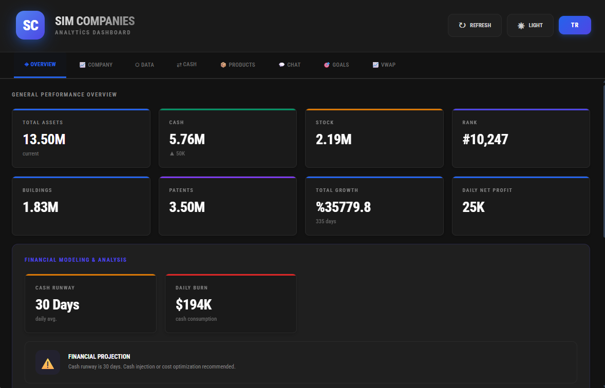
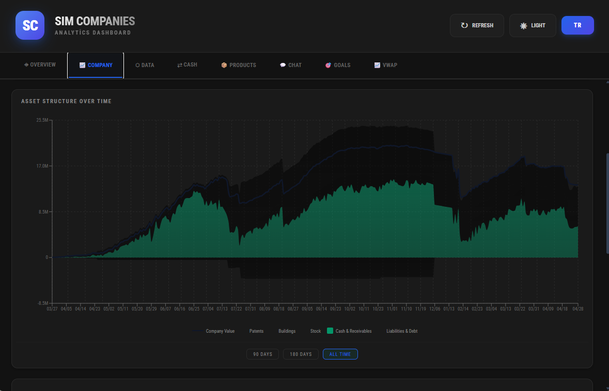
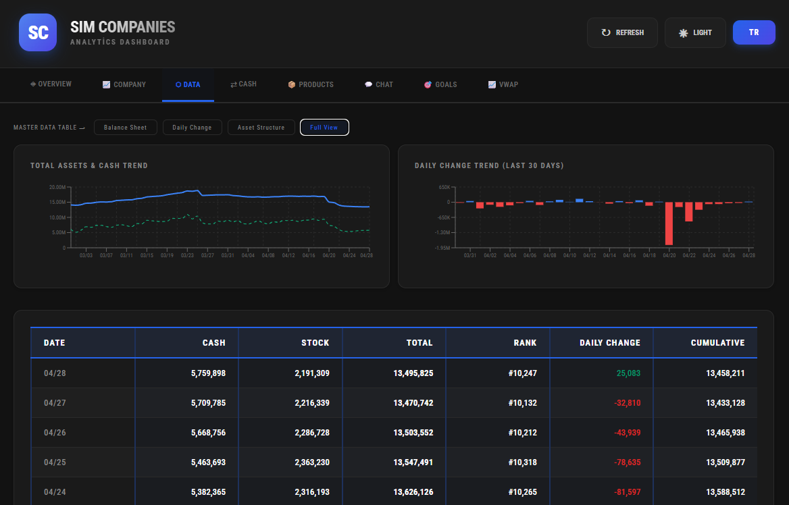
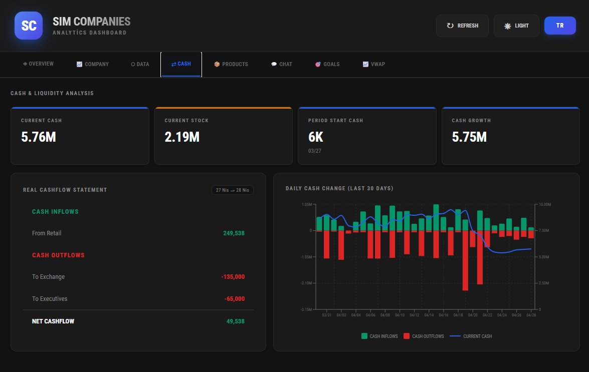
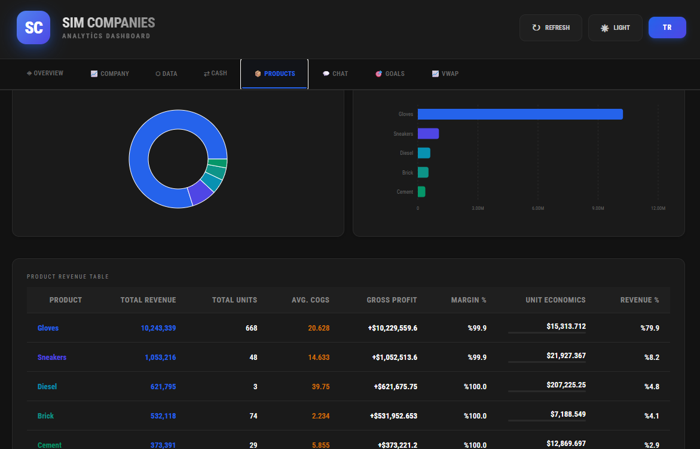
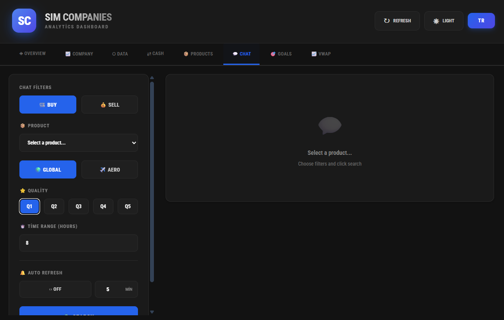
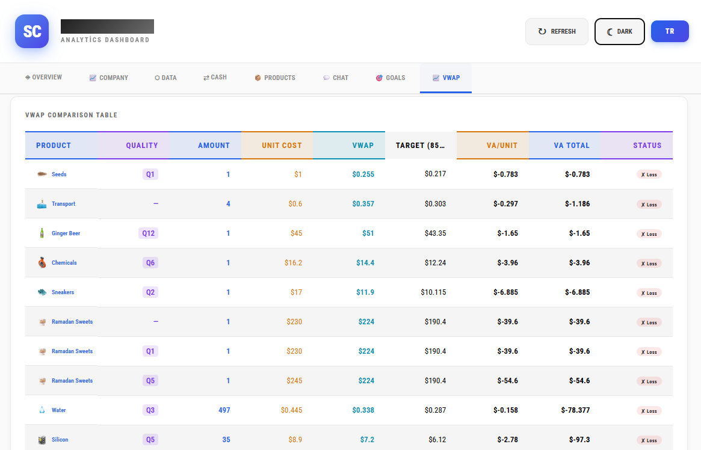

# Sim Companies Analytics Dashboard
    2
    3 A comprehensive financial and business management dashboard designed for tracking performance, assets, and market data in the **Sim Companies** simulation.
    4
    5 This repository contains UI screenshots showcasing the various analytics modules and reporting tools available in the platform.
    6
    7 ## Features & Previews
    8
    9 The dashboard is divided into several specialized tabs, each providing deep insights into different aspects of company management.
   10
   11 ### 📊 General Performance Overview
   12 Provides a high-level summary of the company's health, including total assets, cash position, stock value, and rank. It also features financial modeling and analysis to track cash runway and daily burn
      rates.
   13 
   14
   15 ### 📈 Asset Structure Analysis
   16 Visualizes the growth and composition of company assets over time. The interactive charts allow for tracking Cash & Receivables, Buildings, Patents, and overall Company Value fluctuations.
   17 
   18
   19 ### 🗓️ Historical Data & Trends
   20 A master data table view accompanied by trend charts for Total Assets and Daily Changes, allowing for granular day-to-day performance tracking.
   21 
   22
   23 ### 💸 Cash & Liquidity Management
   24 Focuses on liquidity analysis with a real cashflow statement (Inflows vs. Outflows) and daily cash change visualizations to ensure financial stability.
   25 
   26
   27 ### 📦 Product Performance & Revenue
   28 Detailed breakdown of product-specific metrics. Includes volume distribution charts and a comprehensive revenue table covering units sold, average COGS, gross profit, and margins.
   29 
   30
   31 ### 🔍 Market & Chat Filtering
   32 A robust filtering interface for searching through market data or chat logs by product, quality, and transaction type (Buy/Sell).
   33 
   34
   35 ### ⚖️ VWAP & Value Added Comparison
   36 A specialized comparison tool (available in light theme) for tracking Volume-Weighted Average Price (VWAP) against unit costs to calculate real Value Added (VA) and profit/loss metrics for various goods.
   37 
   38
   39 ---
   40
   41 *Note: These images represent the UI/UX design and data visualization capabilities of the Sim Companies Analytics Dashboard.*
